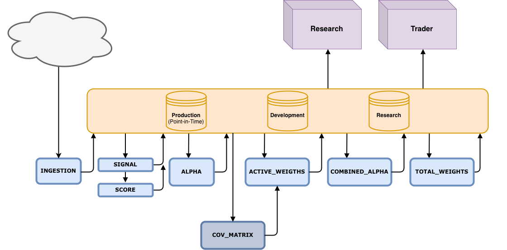

# Silver Fund Quant Data Pipelines

This repository contains ingestion and production pipelines for the quant platform.  
All pipelines are executed via a Click-based command line interface (CLI).

## Infrastructure Overview




The system supports:

- **Backfills** — historical processing over a date range
- **Daily Updates** — incremental updates over recent market days

---

# Table of Contents

- [Architecture Overview](#architecture-overview)
- [Environment Setup](#environment-setup)
- [Databases & Environments](#databases--environments)
- [CLI Usage](#cli-usage)
- [Pipeline Reference](#pipeline-reference)
  - [Barra](#1-barra-pipeline-barra)
  - [CRSP](#2-crsp-pipeline-crsp)
  - [CRSP v2](#3-crsp-v2-pipeline-crsp_v2)
  - [FTSE](#4-ftse-pipeline-ftse)
  - [Signals](#5-signals-pipeline-signals)
  - [Portfolio (Full Production Flow)](#6-portfolio-pipeline-portfolio)
- [Operational Notes](#operational-notes)
- [Common Workflows](#common-workflows)
- [Command Summary](#command-summary)

---

# Architecture Overview

The system consists of:

### Ingestion Pipelines
- Barra
- CRSP
- CRSP v2
- FTSE

These pull raw vendor data into year-partitioned parquet tables.

### Production Model Pipelines
- Signals
- Portfolio

The **Portfolio pipeline** runs the full modeling stack:

1. Signals
2. Scores (cross-sectional z-scores)
3. Signal alphas  
   `signal_alpha = score * ic * specific_risk`
4. Combined alpha (via combinator)
5. Optimal weights (mean-variance optimization)

All intermediate stages are persisted for auditability.

---

# Environment Setup

## 1. Python Environment

Install required packages:

```bash
pip install polars click python-dotenv


## Setup
1. Initialize Python virtual environment

```bash
uv sync
```

2. Add a .env file in the root of your working directory with the following environment variables
- ROOT: The path to your home directory
- WRDS_USER: The username to your WRDS account

## Running pipelines
1. Activate Python virtual environment

```bash
source .venv/bin/activate
```

2. Run Desired Pipeline

### Usage
The CLI entrypoint exposes multiple subcommands:

```bash
python -m <package_name> <command> <pipeline_type> [OPTIONS]
```

To see all available commands:
```bash
python -m <package_name> --help
```

To see help for a specific command:
```bash
python -m <package_name> barra --help
```

### Common Arguments
1. pipeline_type
Specifies how the pipeline should run.
- backfill: Run a historical backfill between two dates
- update: Run the latest incremental update (only supported for Barra data)

2. --database
Valid values:
- research
- production
- development

3. --start
Start date for backfills
- format: YYYY-MM-DD

4. --end
End date for backfilss
- format: YYYY-MM-DD

### example usage for Barra data
1. Run the following to backfill or update barra data

```bash
python pipelines barra backfill --database production
python piplines barra update --database production
```